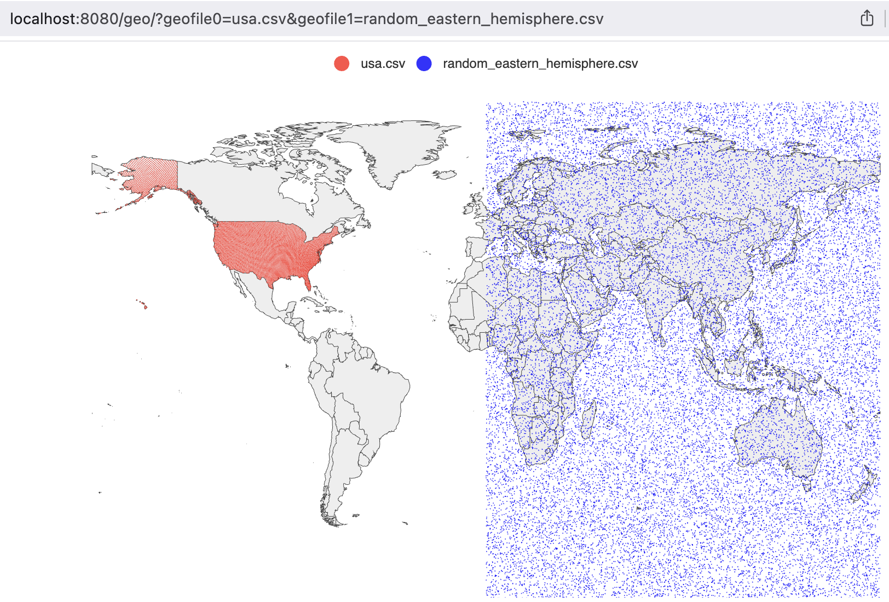

# geoplot

geoplot is a simple tool to visualize CSV files containing latitude and longitude data on a world map.  
It uses "github.com/go-echarts/go-echarts" for rendering.

## Usage

1. Run the server, it listens on localhost:8080.

2. Open your browser, visit:     
   http://localhost:8080/geo/?geofile0=usa.csv&geofile1=latlon.csv  
   You can specify up to 100 files using query parameters: geofile0, geofile1, ..., geofile99

3. CSV Format  
   Each file should have lines in the following format: ...,latitude,longitude
   - The first field that can be parsed as a valid latitude will be treated as the latitude  
   - The next field will be treated as the longitude
